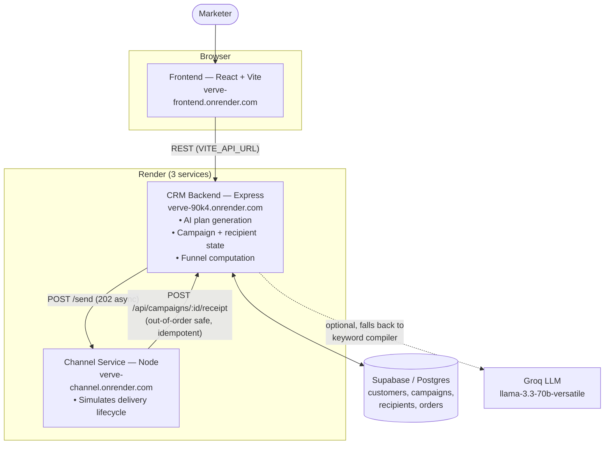

# Verve — AI-Native Campaign Co-Pilot for Daybreak Coffee

> **AI proposes campaigns. Humans approve them. Nothing sends autonomously.**

Verve is a full-stack marketing campaign co-pilot that lets marketers plan campaigns in minutes instead of hours. You describe a goal in plain English, the AI generates a complete campaign plan (audience + messaging + channel recommendation + risk checks), you review and approve it, the campaign runs live, and results flow into a real-time dashboard. When it completes, AI analyzes what happened and recommends the next campaign.

**Live demo:** https://verve-frontend.onrender.com
> ⚠️ Hosted on Render's free tier — services sleep after ~15 min of inactivity, so the **first request after idle takes 30–60s to wake up**, then it's fast. Please be patient on the initial load.

This project demonstrates:
- **AI-native workflow** — AI for thinking, humans for deciding
- **Pragmatic system design** — callback-driven architecture, monotonic state machine, exponential backoff
- **Full-stack execution** — React 19 frontend, Express backend, Supabase database, Groq LLM integration

---

## Architecture

Three independent services that communicate only over HTTP. The CRM never blocks on delivery — it hands off to the Channel Service and receives delivery receipts via asynchronous callbacks.



### Request flow (launch → live funnel)
1. Marketer types a goal → frontend calls `POST /agent/plan` → CRM returns a structured plan (audience + messages + channel + guardrails).
2. Marketer approves → `POST /campaigns` → CRM persists the campaign and calls the Channel Service's `POST /send` (gets `202 Accepted`, never blocks).
3. Channel Service simulates each recipient's journey and streams receipts back to `POST /api/campaigns/:id/receipt`.
4. CRM advances recipient state (monotonically) and recomputes the funnel; the frontend polls `GET /campaigns/:id` and re-renders live.
5. On completion, `GET /campaigns/:id/postmortem` returns AI analysis + the next recommended campaign.

### Key design decisions

**1. Two services over HTTP (not RPC)**
- CRM and Channel Service are independent and communicate only via HTTP callbacks.
- CRM never blocks: it sends the launch request, gets `202 Accepted`, and continues.
- **Benefit:** Either service can restart without breaking the other; scales to many concurrent campaigns.

**2. Monotonic state machine (correctness)**
Recipients flow through states in strict order: `Sent(0) → Delivered(1) → Read(2) → Opened(3) → Clicked(4) → Ordered(5)`.
- Receipts can arrive **out of order** (network delays) or be **duplicated** (retries).
- Only events that *advance* the rank are applied — a late `Delivered` after `Opened` is ignored, and duplicates are no-ops.
- **Benefit:** Correct metrics even under worst-case delivery conditions.

**3. Sampling + extrapolation (speed without scale)**
- Track ~100 real recipients per campaign, then extrapolate to the full audience.
- If 50 of 100 ordered → estimate 5,000 of 10,000.
- **Trade-off:** A demo simplification; production would log every event.
- **Benefit:** Real-time performance without tens of thousands of row inserts per campaign.

**4. Exponential backoff retries (resilience)**
- Inter-service HTTP calls retry with backoff (≈500ms, 1s, 2s).
- If all attempts fail, it's logged and the campaign continues — no cascading failures.

---

## Quick Start (local, ~5 minutes)

The repo is a **monorepo**: `frontend/` (React) and `backend/` (Express CRM + Channel Service).

### 1. Backend (CRM + Channel Service)

```bash
cd backend

# Set up environment
cp .env.example .env
# Fill in: SUPABASE_URL, SUPABASE_SERVICE_ROLE_KEY
# Optional: GROQ_API_KEY (enables real AI planning; falls back to keyword rules if unset)

# Create the database schema in the Supabase SQL editor:
#   run  schema.sql            (fresh DB)
#   then migrations/*.sql      (incremental updates)

npm install
npm run seed        # Loads ~2,000 customers + saved audiences
npm run dev:all     # Runs CRM (:4000) + Channel Service (:4100) together
```

### 2. Frontend

```bash
cd frontend

npm install
echo "VITE_API_URL=http://localhost:4000" > .env
npm run dev         # Opens http://localhost:5173
```

**Mock mode (no backend):** Leave `VITE_API_URL` unset — the UI runs entirely in-browser with deterministic seeded data.

---

## Tech Stack

### Frontend (`frontend/`)
- **React 19** + **Vite**
- **TypeScript** for type safety across the API boundary
- **Tailwind v4** + **shadcn/ui**
- **TanStack Query** (data fetching, caching, polling while campaigns are live)
- **React Router v7**
- **Recharts** (funnel & metrics visualization)
- **Zod** (API response validation)

### Backend (`backend/`)
- **Express.js** (CRM + Channel Service)
- **Supabase / Postgres** (customers, campaigns, recipients, orders)
- **Groq** (OpenAI-compatible LLM for plan generation; `llama-3.3-70b-versatile`)
- **Node.js / TypeScript**

### Architecture pattern — single API seam, dual mode
```
Component → TanStack Query hook → API client → [ MOCK data  OR  real fetch ]
```
- Set `VITE_API_URL` → real backend. Leave it unset → deterministic mock data.
- Same codebase, one flag — components never change.

---

## Core Features

### 1. AI-native campaign planning
`POST /agent/plan` turns natural language into a structured, validated plan (audience filter + persona + per-channel messages + recommended channel + guardrail checks).
- Output **validated with Zod** before it's trusted.
- Real-time audience count from actual customer data.
- **Fallback:** if `GROQ_API_KEY` is missing or the call fails/validation fails, a deterministic keyword compiler takes over — the app always works.

### 2. Live campaign dashboard
- Real-time **funnel chart** (Recharts): Sent → Delivered → Read → Opened → Clicked → Order
- **Per-recipient lifecycle** table
- **Failure breakdown** (invalid number, spam blocked, etc.)
- **Attributed revenue** tied to campaigns

### 3. AI postmortem & learning loop
- Open/click/conversion analysis
- **Cohort analysis** — e.g. "83% of converters are high-value customers"
- **Recommended next campaign**, with one-click hand-off that pre-fills the Co-pilot

### 4. Customer & audience management
- Searchable customer base (~2,000 customers across 6 Indian metros)
- Saved audiences with live counts
- AI-interpreted filter conditions

---

## API Endpoints (CRM)

| Endpoint | Method | Purpose |
|---|---|---|
| `/agent/plan` | POST | Generate a campaign plan from a goal |
| `/audiences` | GET | List saved audience segments |
| `/audiences/preview` | POST | Live count for a filter |
| `/campaigns` | POST | Launch a campaign |
| `/campaigns` | GET | List all campaigns |
| `/campaigns/:id` | GET | Campaign detail (funnel + recipients) |
| `/campaigns/:id/postmortem` | GET | AI analysis + next-campaign recommendation |
| `/campaigns/:id` | DELETE | Delete a campaign |
| `/api/campaigns/:id/receipt` | POST | Delivery-receipt webhook (called by Channel Service) |
| `/customers` | GET | Search customers |
| `/customers/ingest` | POST | Bulk load customers (seed) |
| `/orders/ingest` | POST | Bulk load orders (seed) |

---

## Project Structure

```
Verve/                              # monorepo
├── frontend/                       # React + Vite
│   ├── src/
│   │   ├── pages/                  # Copilot, Campaigns, CampaignDetail, Customers, Audiences
│   │   ├── components/
│   │   │   ├── campaign/           # Funnel chart, postmortem, detail panel
│   │   │   ├── plan/               # Campaign plan card, message previews
│   │   │   ├── layout/             # AppShell, Sidebar (responsive drawer), TopBar
│   │   │   └── common/             # EmptyState, StatusPill, MetricCard, ...
│   │   ├── hooks/                  # TanStack Query wrappers (useCampaigns, useLaunchCampaign, ...)
│   │   ├── lib/
│   │   │   ├── api/                # API client + mock layer
│   │   │   └── types.ts            # Zod schemas + inferred TypeScript types
│   │   └── index.css               # Tailwind + custom animations
│   ├── vite.config.ts
│   └── package.json
│
└── backend/                        # Express
    ├── src/
    │   ├── server.ts               # CRM: /agent/plan, /campaigns, funnel, receipt webhook
    │   ├── channelService.ts       # Separate process simulating delivery
    │   ├── agentPlanner.ts         # Groq integration + keyword fallback
    │   ├── seed.ts                 # Load customers + sample audiences
    │   ├── db/queries.ts           # Database helpers
    │   └── helpers/
    │       ├── audience.ts         # Cohort analysis, overlap detection
    │       └── channel.ts          # Retry logic
    ├── schema.sql                  # Postgres schema
    ├── migrations/                 # Incremental schema updates
    └── package.json
```

---

## Deployment (live on Render)

Three Render web services off the same repo (`main` branch):

| Service | Root dir | Build command | Start command |
|---|---|---|---|
| **verve-crm** (CRM) | `backend` | `npm install && npm run build` | `node dist/server.js` |
| **verve-channel** | `backend` | `npm install && npm run build` | `node dist/channelService.js` |
| **verve-frontend** | `frontend` | `npm install && npm run build` | `npm run preview -- --host` |

### Environment variables

| Service | Variable | Value / notes |
|---|---|---|
| verve-frontend | `VITE_API_URL` | CRM URL, e.g. `https://verve-90k4.onrender.com` (baked in at **build time** — redeploy after changing) |
| verve-crm | `SUPABASE_URL`, `SUPABASE_SERVICE_ROLE_KEY` | Supabase project credentials |
| verve-crm | `CHANNEL_SERVICE_URL` | `https://verve-channel.onrender.com` |
| verve-crm | `GROQ_API_KEY`, `GROQ_MODEL` | optional (AI planning; falls back to keyword rules) |
| verve-channel | `CRM_URL` | `https://verve-90k4.onrender.com` (where receipts are posted back) |

> The three services sleep independently on the free tier. The frontend wakes the CRM on first load; launching a campaign wakes the Channel Service.

---

## Development Commands

```bash
# Backend (from backend/)
npm run dev:all          # CRM (:4000) + Channel Service (:4100), concurrently
npm run dev              # CRM only
npm run dev:channel      # Channel Service only
npm run build            # tsc → dist/
npm run start            # node dist/server.js (production CRM)
npm run start:channel    # node dist/channelService.js (production channel)
npm run seed             # Reset / load sample data

# Frontend (from frontend/)
npm run dev              # Vite dev server (:5173)
npm run build            # tsc -b && vite build
npm run preview          # Preview the production build
npm run lint             # ESLint
```

### Testing the flow
1. **Mock mode:** `cd frontend && npm run dev` (no backend needed).
2. **Real backend:** `cd backend && npm run dev:all`, then `cd frontend && npm run dev` → open http://localhost:5173 → create a campaign → watch the funnel update live.

---

## Design Philosophy

1. **Human judgment stays human.** The marketer approves every campaign — AI can't send unilaterally.
2. **Simplicity over features.** No A/B testing, scheduling, or auth — just: think, approve, run, learn.
3. **Correctness by default.** The state machine prevents metric bugs even under worst-case delivery.
4. **Pragmatic scaling.** Sampling + callbacks handle many campaigns without infra complexity.

---

## Notes

- **No auth** — open access (demo assumption).
- **No real messaging** — the Channel Service simulates SMS/WhatsApp/Email delivery.
- **Sampling by design** — ~100 tracked recipients per campaign, extrapolated (not production scale).
- **Groq is optional** — without `GROQ_API_KEY`, planning falls back to deterministic keyword rules.

Built with pragmatism, clarity, and human judgment at the center.
